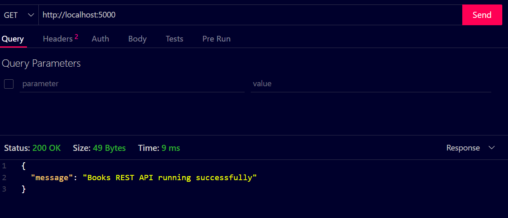
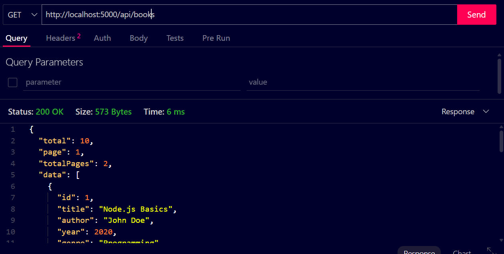
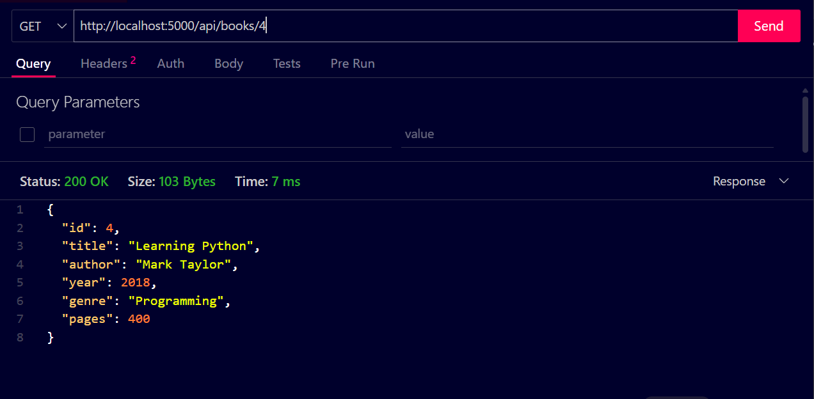
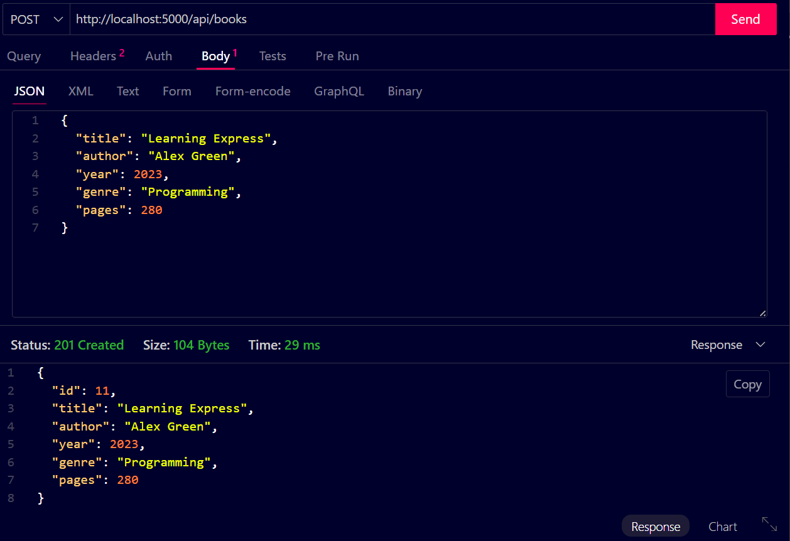
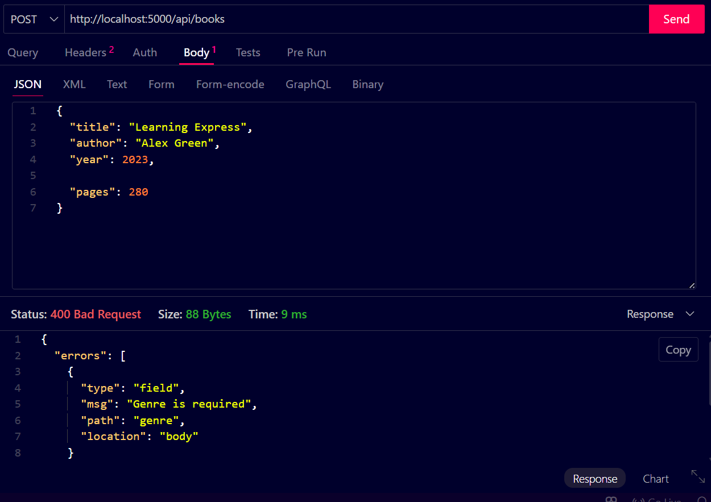
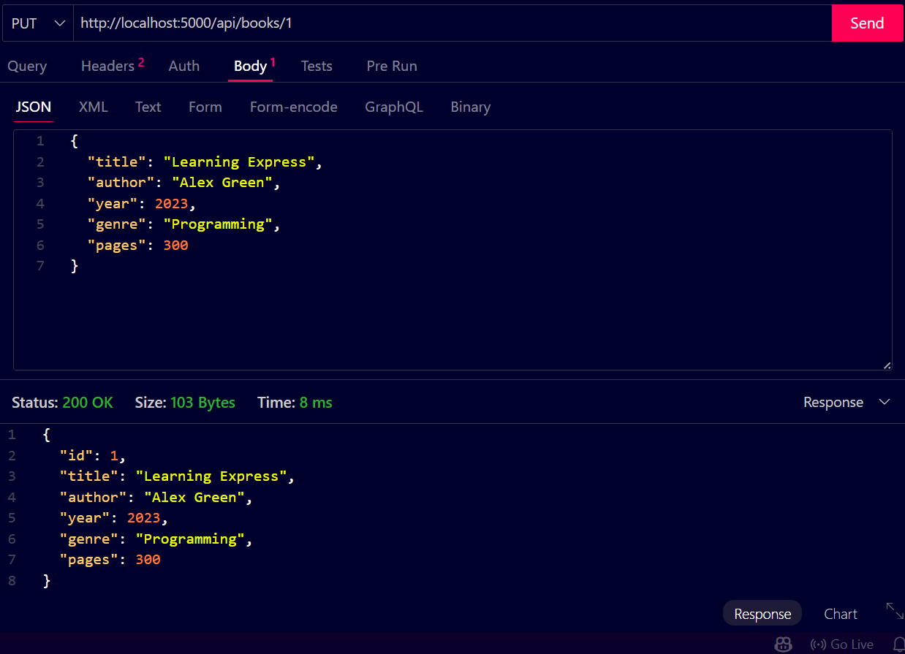
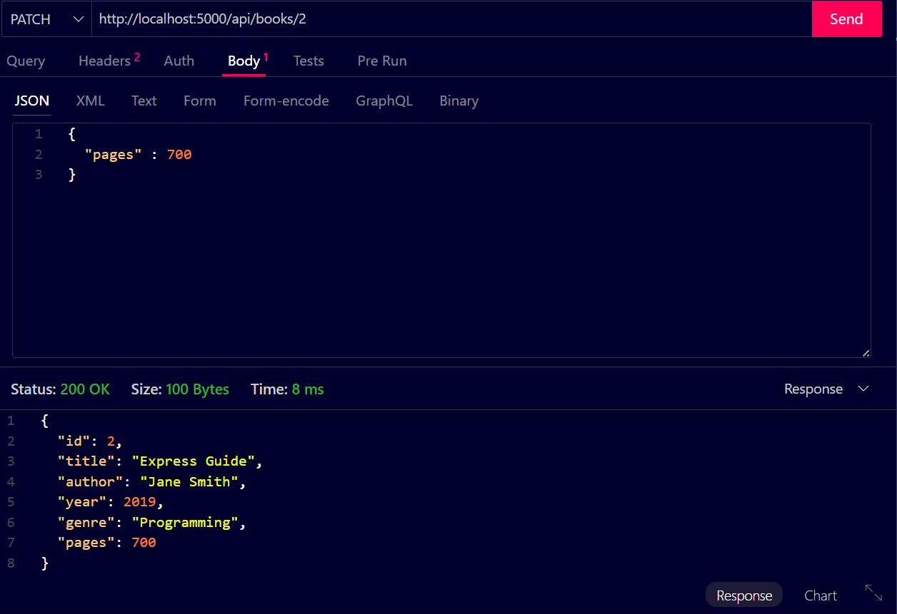

# 📚 Books REST API

A RESTful API for managing books with Node.js and Express.

---

## 🖼️ Screenshots

### 1️⃣ Root Endpoint
`GET /`

---

### 2️⃣ Get All Books
`GET /api/books`

---

### 3️⃣ Get Book By ID
`GET /api/books/:id`

---

### 4️⃣ Create New Book
`POST /api/books`

---

### 5️⃣ Validation Error (POST)
Example of missing/invalid fields.

---

### 6️⃣ Update Book (PUT)
`PUT /api/books/:id`

---

### 7️⃣ Partial Update (PATCH)
`PATCH /api/books/:id`

